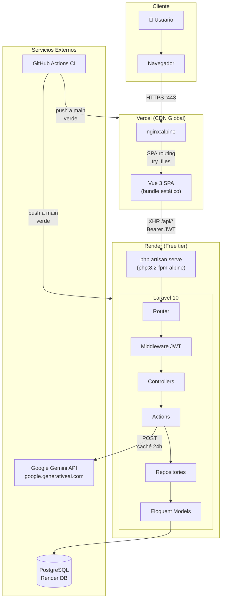
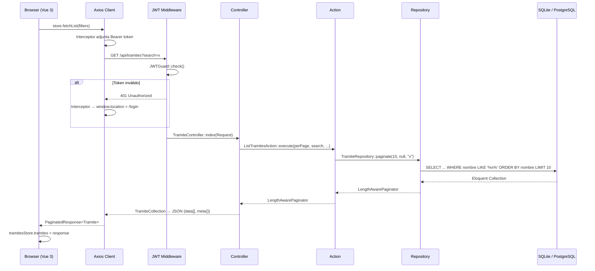
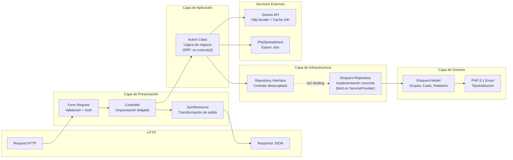
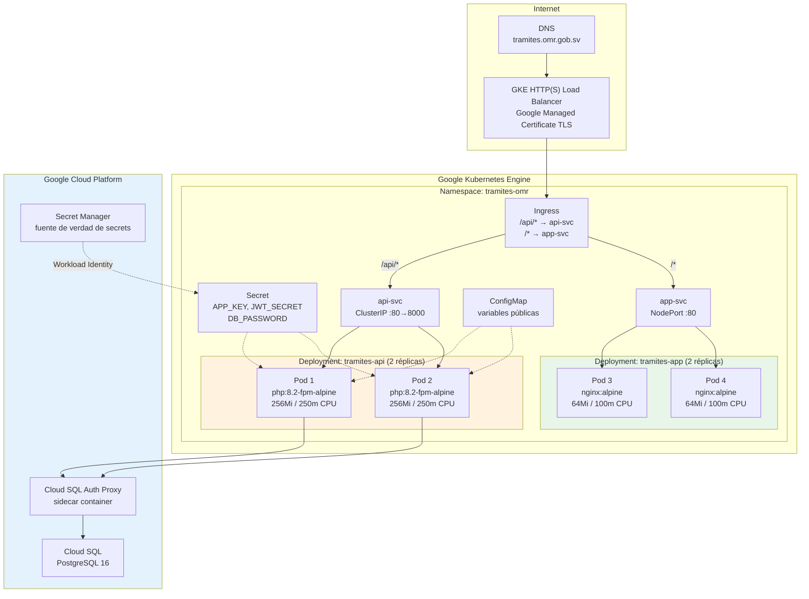

# Arquitectura del Sistema

## Diagrama de alto nivel — Flujo de producción

## Diagrama de flujo — Request típico autenticado

## Diagrama de capas — Backend Laravel

## Diagrama de despliegue — Infraestructura de referencia (GKE)

## Decisiones de infraestructura

| Aspecto             | Demo (actual)          | Producción (GKE)                      |
| ------------------- | ---------------------- | ------------------------------------- |
| Servidor web        | php artisan serve      | php-fpm + nginx (o FrankenPHP)        |
| Base de datos       | SQLite (local) / Render PG | Cloud SQL PostgreSQL con réplicas |
| Secrets             | .env / Render env vars | GCP Secret Manager + Workload Identity |
| Imágenes Docker     | :latest                | SHA del commit (inmutable)            |
| Escalado            | 1 instancia            | HPA: 2-10 réplicas por CPU/RPS        |
| TLS                 | Render automático      | Google Managed Certificate            |
| Observabilidad      | Logs de Render         | Cloud Logging + Cloud Monitoring      |
