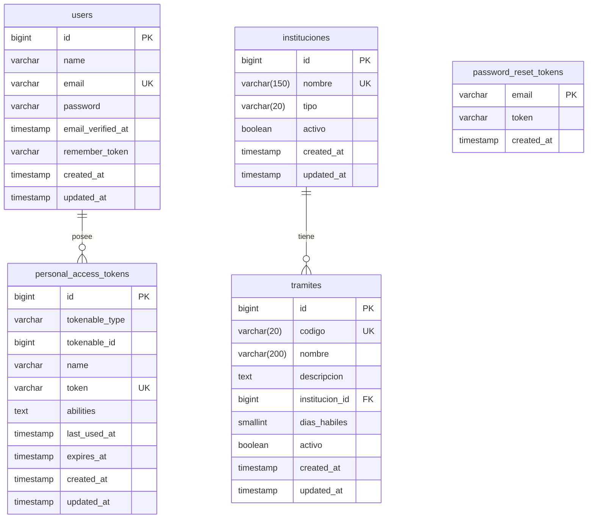

# Diagrama Entidad-Relación

Modelo de datos del Sistema de Trámites OMR.

## Diagrama ER

## Notas del modelo

### `instituciones`

| Campo  | Tipo          | Restricción | Descripción                                              |
| ------ | ------------- | ----------- | -------------------------------------------------------- |
| tipo   | varchar(20)   | NOT NULL    | Enum: `MINISTERIO`, `ALCALDIA`, `AUTONOMA`               |
| activo | boolean       | DEFAULT true | Soft delete lógico — no se usan `SoftDeletes` de Laravel |

### `tramites`

| Campo          | Tipo          | Restricción | Descripción                                                  |
| -------------- | ------------- | ----------- | ------------------------------------------------------------ |
| codigo         | varchar(20)   | UNIQUE      | Código oficial del trámite (ej. `TRM-0001`)                  |
| institucion_id | bigint FK     | RESTRICT    | `ON DELETE RESTRICT`: no se puede eliminar la institución si tiene trámites |
| dias_habiles   | smallint      | NOT NULL    | Plazo legal máximo de resolución                             |
| activo         | boolean       | DEFAULT true | Soft delete lógico — inactivar sin borrar historial          |

### ¿Por qué `activo` y no `deleted_at`?

`activo` boolean modela un **estado de negocio explícito** en el dominio regulatorio:
un trámite inactivo no es un registro eliminado — sigue existiendo en el historial
y puede ser consultado por auditores. `SoftDeletes` requiere `withTrashed()` en cada
query y su semántica es más "borrar con posibilidad de restaurar" que "cambiar estado".

### Restricción RESTRICT en `institucion_id`

`restrictOnDelete()` previene que se elimine una institución que tiene trámites
asociados, manteniendo la integridad referencial en ambos motores (SQLite y PostgreSQL).
La alternativa `CASCADE` borraría trámites silenciosamente, lo cual es peligroso
en un contexto regulatorio donde el historial debe preservarse.
